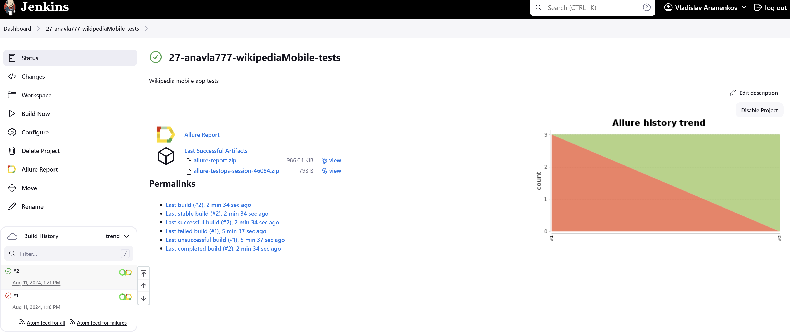
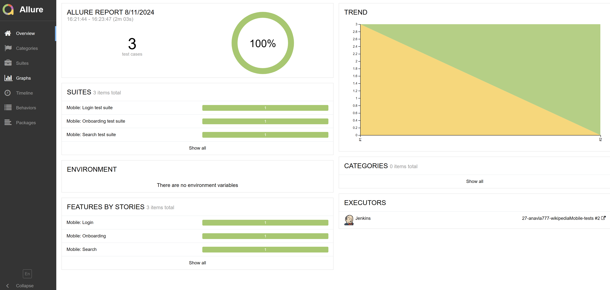
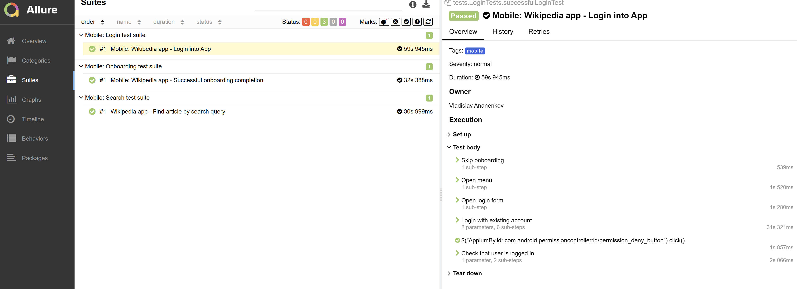
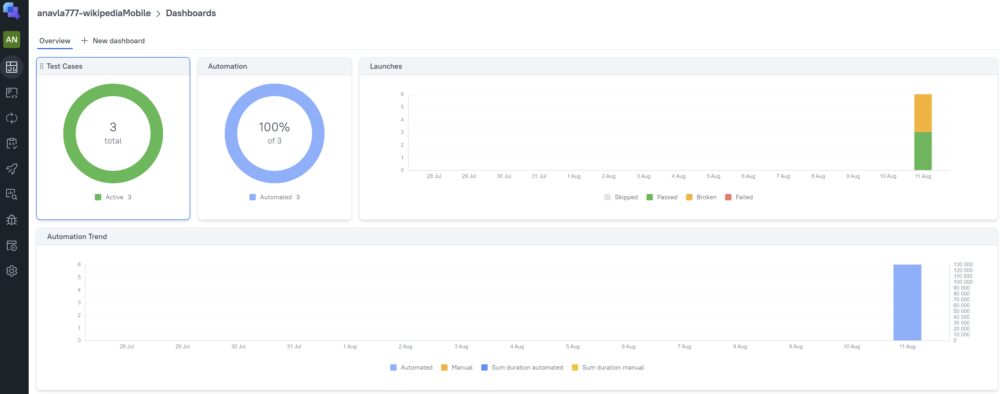
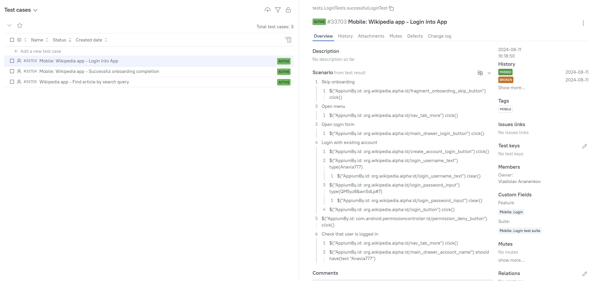
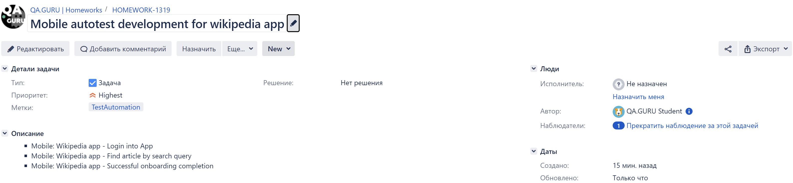
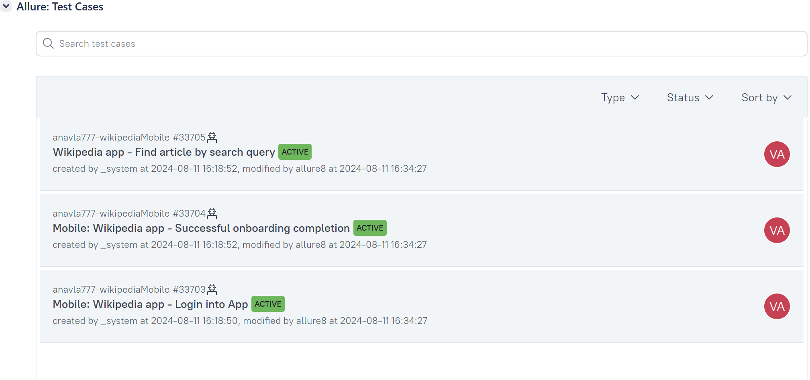
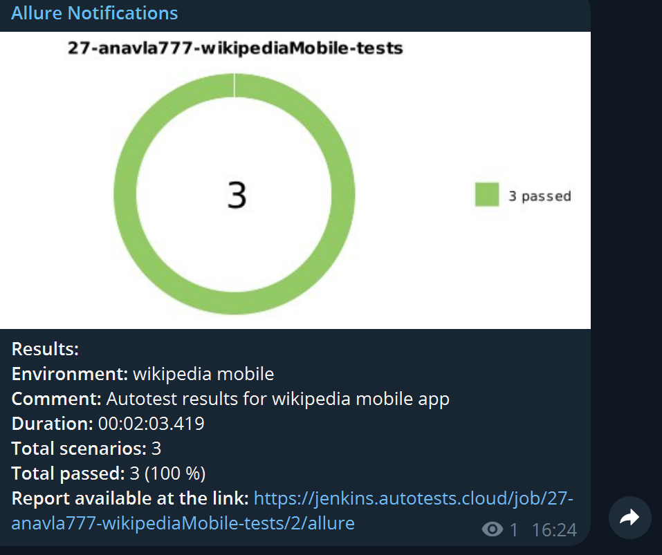

# Wikipedia mobile app automation
<p align="center"> 
<a href="https://twitch.tv"></a>
</p>

 > Wikipedia is a free online encyclopedia, created and edited by volunteers around the world and hosted by the Wikimedia Foundation.
## **Table of contents:**
____

* <a href="#tools">Technology stack</a>
* <a href="#cases">Implemented autotests</a>
* <a href="#console">Launch from command line</a>
* <a href="#allure">Allure report</a>
* <a href="#testops">Allure TestOps Integration</a>
* <a href="#jira">Jira Integration</a>
* <a href="#telegram"> Telegram Notifications</a>
* <a href="#video">Examples of test execution in Browserstack</a>
____
## Main project features
- Project contains mobile tests
- Ability to launch on emulator or ob Browserstack remote device
- Remote launch via Jenkins with Allure report and Telegram notification
---
<a id="tools"></a>
## <a name="Technonlogy stack">**Technology stack**</a>

<p align="center">  
<a href="https://www.java.com/"></a>
<a href="https://www.jetbrains.com/idea/"></a>   
<a href="https://github.com/"></a>  
<a href="https://junit.org/junit5/"></a>  
<a href="https://gradle.org/"></a>
<a href="https://appium.io/"></a>
<a href="https://developer.android.com/studio"></a>
<a href="https://www.browserstack.com/"></a>  
<a href="https://github.com/allure-framework/allure2"></a> 
<a href="https://qameta.io/"></a>   
<a href="https://www.jenkins.io/"></a>
<a href="https://www.atlassian.com/software/jira"></a>
<a href="https://telegram.org/"></a>
</p>

- [x] `IntelliJ IDEA` - IDE, used for project development
- [x] `Java` - Project programming language
- [x] `Gradle` - Project builder
- [x] `Junit5` - Test framework
- [x] `Appium` - Mobile testing framework
- [x] `Browserstack` - Cloud platform with remote access to mobile devices
- [x] `Android Studio` - IDE for mobile device emulation
- [x] `Jenkins` - CI/CD for remote test runs
- [x] `Allure Report` - Test reporting tool
- [x] `Allure TestOps` - Test Management tool
- [x] `Telegram` - Messenger for test report notifications
- [x] `Jira` - Bugtracker system

____
<a id="cases"></a>
## <a name="Implemented tests">**Implemented tests:**</a>
____
### Mobile
- [x] Mobile: Wikipedia app - Login into App
- [x] Wikipedia app - Find article by search query
- [x] Mobile: Wikipedia app - Successful onboarding completion
____
<a id="jenkins"></a>
## </a><a name="Building"></a>Building in [Jenkins](https://jenkins.autotests.cloud/job/27-anavla777-wikipediaMobile-tests/)</a>
____
<p align="center">  
  
</p>
Jenkins doesn't contain any parameters , except auth property files, just paste your own auth data and simply run:

```bash
clean test
  ```

<a id="console"></a>
## Launch commands

---

Project allows to run tests locally

Before local start, adjust:
- deviceName in emulation.properties in src/test/resources/config/ directory (run in simulated device).
- auth.properties file in src/test/resources/config/
    In this file specify:
  - username = *wikipedia app username*
  - password = *wikipedia app password*

For browserstack runs you should also add your credentials in:
- browserStackAuth.properties file in src/test/resources/config/

In this file specify:
- browserStackUser=*your browserstack username*
- browserStackPassword=*your browserstack password*


- launch tests on emulator
```bash
gradle clean test -DdeviceHost=emulation
  ```
- launch on real connected device
```bash  
gradle clean test -DdeviceHost=real
  ```
### <a id="mobile"> Local mobile test run setup</a>

EMULATION (-DdeviceHost=emulation)

In order to start mobile test on emulator properly, perform the following:

- Install all software according to [instruction](https://autotest.how/appium-setup-for-local-android-tutorial-md)
- Open <code>Andoid Studio</code>, open Virtual Device Manager
- Launch image Pixel_8_API_34 (or anything else specified as deviceName in emulation.properties)
- Open command line and launch Appium server:
```bash
appium server --base-path /wd/hub
```
- run tests:
```bash
gradle clean test -DdeviceHost=emulation
```
Another parameters in emulation.properties also can be configured

REAL (-DdeviceHost=real)

In order to start mobile test on real device properly, perform the following:

- Install all software according to [instruction](https://autotest.how/appium-setup-for-local-android-tutorial-md)
- Connect real device via USB to local machine, in which tests will be performed
- Open command line and navigate to platform-tools (where SDK ins installed (example, C:
  \Users\user\AppData\Local\Android\Sdk\platform-tools))
- Type ./adb devices
- Change deviceName in src\test\resources\config\real.properties to deviceName from previous step
- Open command line and launch Appium server:
```bash
appium server --base-path /wd/hub
```
- run tests:
```bash
gradle clean test -DdeviceHost=real
```
Another parameters in real.properties also can be configured
___
<a id="allure"></a>
## </a> <a name="Allure"></a>Allure [report](https://jenkins.autotests.cloud/job/27-anavla777-twitch-tests/allure/)</a>
___

### *Report main page*

<p align="center">  
  
</p>  

### *Graphs*

  <p align="center">  

</p>

---
<a id="testops"></a>
## <b><a target="_blank" href="https://allure.autotests.cloud/project/4333">Allure TestOps</a></b> Integration
___
>Test run graphs
>


>Test Cases:
>
 

---
<b><a id="jira" target="_blank" href="https://jira.autotests.cloud/browse/HOMEWORK-1316">Jira</a></b> Integration
---
>Jira task
>


>In `Allure:Test Cases` section test cases are displayed
>


<a id="telegram"></a>
## </a> Telegram Notifications
____
<p align="center">  
  
</p>

____
<a id="video"></a>
## </a> Example of test execution in Browserstack
____
<p align="center">
   
</p>
